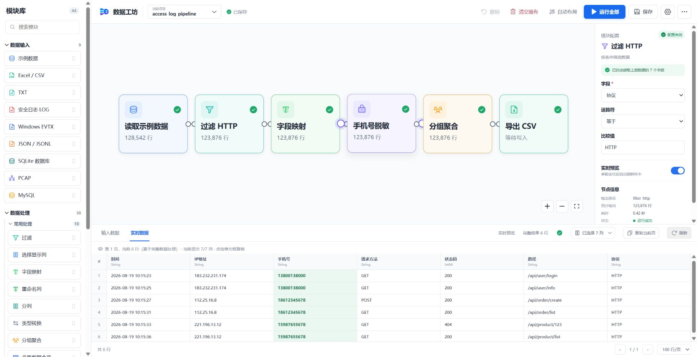
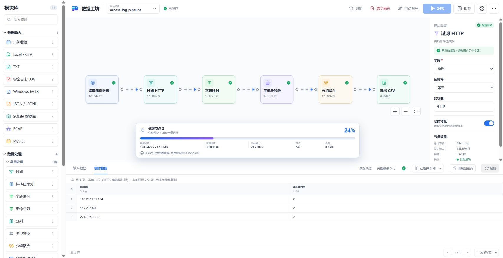

# 数据工坊（Data Workbench）

<p align="center">
  
</p>

<p align="center">
  面向 CTF、安全分析与通用数据清洗的本地优先、模块化可视化数据处理工具。
</p>

<p align="center">
  <a href="README_EN.md">English</a> ·
  <a href="docs/ARCHITECTURE.md">架构设计</a> ·
  <a href="docs/PLUGIN_LIBRARY.md">插件库</a> ·
  <a href="docs/PLUGIN_DEVELOPMENT.md">插件开发</a> ·
  <a href="CONTRIBUTING.md">参与贡献</a>
</p>

> 当前版本为早期公开预览版。它已经可以完成真实的数据读取、处理、预览和完整导出，但插件 API 和项目文件格式在 `1.0.0` 前仍可能调整。

## 项目简介

数据工坊把数据输入、处理和输出能力都设计为可插拔节点。你可以把节点拖入画布、连接数据流、用表单配置参数，并在任意节点查看输入数据和处理结果。它尤其适合需要快速组合多种编码、日志、流量和表格处理步骤的 CTF 比赛与安全考试场景。

与只处理当前表格页面的前端工具不同，数据工坊明确区分：

- **实时预览**：分页或抽样展示，优先保证交互速度；
- **正式运行**：对完整数据源执行整条流程；
- **完整导出**：导出正式运行的全部结果，不受预览页大小影响。

## 界面预览

### 模块化工作台

左侧是可搜索、可折叠的模块库，中间是带方向箭头和网格的流程画布，右侧根据所选节点自动生成配置表单，底部同时承担输入数据与处理结果预览。



### 全量运行进度

加载或处理数据时，画布底部会显示醒目的活动条。正式运行会展示整体百分比、估算数据量、已处理条数、当前输出、节点位置和耗时；画布连线同步显示数据流动动画。



## 一分钟上手

1. 首次打开时保持空画布；点击或拖入任意输入模块，应用会自动创建一个项目。
2. 选择 Excel/CSV、LOG、EVTX、SQLite、MySQL 或 PCAP 等输入，按配置面板选择文件或数据库。
3. 把过滤、字段转换、分组聚合、CTF 解码等处理模块连接到输入节点。
4. 选中任意节点，可在右侧修改“节点名称”；再在底部切换“输入数据”和“实时数据”，检查该节点处理前后的差异。
5. 点击顶部“保存”（也可按 `Ctrl+S`）持久化节点名称、配置、位置、连线和分支出口；项目可使用本地 JSON 或 MySQL 存储并完整恢复。
6. 预览结果符合预期后连接输出节点，点击“运行全部”。只有正式运行才会写文件或数据库。
6. 等待底部进度达到 100%。导出结果来自完整数据范围，不是当前页或快速样本。

一个典型的安全日志流程可以是：

```text
安全日志 LOG → 正则/键值解析 → 过滤 → 字段映射 → 数据去重 → 分组聚合 → JSONL 导出
```

一个典型的 CTF 流量流程可以是：

```text
PCAP → 会话分组 → TCP 流重组 → HTTP/DNS/ICMP 提取 → Hex/Base 解码 → Flag 扫描
```

## 功能亮点

- **可视化流程编排**：节点拖拽、自由连线、方向箭头、自动布局、撤销、清空画布和运行流动动画。
- **简单配置**：自动读取上游字段，列选择、事件选择、映射和聚合均使用可视化表单，尽量避免手写 JSON。
- **双视图预览**：底部可切换“输入数据”和“实时数据”，支持分页、显示列选择、单元格复制和整页 TSV 复制。
- **多源安全数据**：表格、文本、安全日志、EVTX、JSON、SQLite、MySQL、PCAP/PCAPNG。
- **CTF 工具链**：会话分组、TCP 流重组、HTTP/DNS/ICMP 提取、Hex/Base 编解码、XOR/凯撒分析和 Flag 扫描。
- **大数据完整性**：大文件使用快速样本预览；正式运行分批读取并显示进度；大 PCAP 建立 SQLite 磁盘索引。
- **本地优先**：桌面模式默认把项目保存在本机；也可把项目元数据存储到自有 MySQL。
- **插件化扩展**：内置模块和外部模块使用同一份元数据与执行接口，新增插件不需要修改核心执行引擎。

## 内置模块

当前内置 **74 个节点**：9 个输入、60 个处理、5 个输出。

### 数据输入（9）

| 节点 | 适用场景 |
| --- | --- |
| 示例数据 | 无需准备文件，快速体验流程 |
| Excel / CSV | `.xlsx`、`.xls`、`.csv` 表格 |
| TXT | 逐行文本或自定义分隔符文本 |
| 安全日志 LOG | 自动识别、逐行、`key=value`、JSONL、分隔符或正则提取 |
| JSON / JSONL | JSON 数组、嵌套记录和逐行 JSON |
| Windows EVTX | Windows 事件日志，支持常见安全事件 ID 勾选 |
| SQLite 数据库 | `.db`、`.sqlite` 及浏览器取证数据库 |
| MySQL | 库表发现、自定义查询、字符集、SSL、时区和超时参数 |
| PCAP | PCAP/PCAPNG 磁盘索引、协议过滤和分页读取 |

输入节点的配置原则：

- **文件输入**使用 Windows 原生文件选择器，不要求手写绝对路径；
- **字段配置**会从读取到的表头或上游结果自动生成选项；
- **EVTX**内置登录、进程、账号、Kerberos、日志清除、服务安装和 PowerShell 等常见事件 ID；
- **SQLite**支持选择本地数据库，并允许只读的 `SELECT`/`WITH` 高级查询；
- **MySQL**可配置主机、端口、账号、密码、字符集、SSL、时区和连接/读写超时，并自动发现数据库和表；
- MySQL 输入和输出默认展开连接选项：`utf8mb4`、`+08:00`、忽略/禁用 SSL、5 秒连接超时、30 秒读写超时；远程数据库可切换为优先或必须使用 SSL；
- MySQL 输出的“每批写入行数”只控制单批大小，不限制总行数；10000 行、批大小 1000 会连续写入 10 批，完成后再次查询目标表校验完整性；
- **PCAP**首次读取建立本地 SQLite 索引，之后切页不需要重新解析整个流量包。

### 数据处理（60）

| 分类 | 节点 |
| --- | --- |
| 筛选与字段 | 过滤、选择显示列、数据去重、多字段排序、缺失值处理 |
| 字段转换 | 字段映射、重命名列、分列、类型转换、JSON 展平、时间解析与拆分 |
| 文本处理 | 文本检索替换、正则提取、去除空格、合并列、转大写、转小写 |
| 聚合与结构 | 分组聚合、多路数据合并、按键关联两路数据、合并为一行 |
| 安全与编码 | 数据脱敏、IOC 指标提取、Base64、URL 编解码、MD5、SHA、AES-256-GCM |
| CTF 流量分析 | PCAP 会话分组、TCP 流重组 |
| CTF 协议提取 | HTTP、DNS、ICMP 数据提取 |
| CTF 编码解码 | Hex、多种 Base16/32/58/64/85 编解码 |
| CTF 密码分析 | XOR 指定密钥/单字节爆破、凯撒密码爆破 |
| CTF 检测 | Flag 自动扫描 |
| 字段计算 | 计算列、数值计算 |
| 流程控制 | 条件分支、分批落盘 |
| 结构转换 | 透视表、逆透视、行列转换 |
| 多表处理 | 集合运算 |
| 聚合统计 | 窗口统计 |
| 数据质量 | 数据校验、异常行分流 |
| 高级字段计算 | 自定义表达式、CASE WHEN 计算列、区间分组 |
| 高级筛选 | 多条件筛选、行号、Top N、数据采样 |
| 日期时间 | 日期时间计算 |
| 数据对比与批处理 | 数据对比、批量字段处理 |
| 数据分析 | 数据剖析 |

其中：

- **过滤**支持等于、不等于、包含、不包含、大于、大于等于、小于、小于等于、为空和非空；
- **分列**会把一个字段按分隔符拆成两个或更多字段，并允许逐列重命名；
- **分组聚合**可在同一次分组中添加多条规则，例如男女分别计数，同时计算平均分、总分和最大值；
- **多路数据合并**支持纵向追加、共同字段追加和按行号横向拼接，可添加来源列；
- **合并为一行**只保留选中字段，将全部行按指定分隔符连接，最终严格输出一行。
- **按键关联两路数据**支持左关联、内关联、全关联、半关联和反关联，可用于日志与资产、账号或告警表关联；
- **JSON 展平**将告警详情等嵌套对象展开为普通字段，数组保留为 JSON 文本，避免丢失信息；
- **时间解析与拆分**支持自定义格式或常见格式自动识别，可生成时间线分析所需的年月日、时分秒、星期和 Unix 时间戳；
- **IOC 指标提取**从日志中提取并校验 IP，同时识别 URL、域名、邮箱和 MD5/SHA 哈希，每个指标展开为独立行。
- **计算列**支持复制字段、固定值、两个字段拼接和文本长度；**数值计算**支持字段与固定值或另一字段进行加减乘除、取余、次方、取整、绝对值、平方根和对数运算；
- **条件分支**提供“满足”和“不满足”两个真实出口，并可添加文字标记。只需要筛选满足条件的数据时，把“满足”出口连接到下游即可；两个出口也可分别连接文件、数据库或后续处理节点；
- **透视表、逆透视和行列转换**用于宽表与长表之间转换，配置项全部使用自动读取的字段下拉框；
- **集合运算**连接两个上游后执行并集、交集、差集或对称差集；
- **窗口统计**支持分组排名、累计求和、移动平均、上一条值和下一条值，并保持原数据行序；
- **数据校验**使用可视化多规则编辑器，可校验必填、数值、整数、上下限、正则、允许值及唯一性；校验失败的记录会写入“校验通过=false”和具体“校验问题”，这类记录就是异常行；
- **异常行分流**提供“正常”和“异常”两个独立出口。正常出口可连接 MySQL，异常出口可连接 CSV、JSON 或另一个数据库；正式运行时每个出口处理并导出该分支的全部数据，预览分页不会截断导出；
- **分批落盘**在正式运行时把完整中间结果拆成 CSV、JSONL 或 Parquet 文件，实时预览不会写磁盘，且数据仍继续传递给下游节点。
- **自定义表达式**支持字段四则运算、比较及常用白名单函数，不允许导入模块或执行任意 Python 代码；
- **多条件筛选与 CASE WHEN**使用可视化规则编辑器，可添加多条条件并选择“且/或”或依次匹配分类结果；
- **日期时间计算**支持日期加减、两字段时间差、格式化及 Unix 时间戳互转；
- **数据对比**连接两个上游后按唯一标识字段输出新增、缺失、修改和未变化记录；
- **批量字段处理**可一次对多个字段执行空白清理、大小写、空值填充、替换、前后缀和类型转换；
- **行号、Top N 与数据采样**支持分组编号、分组前 N、固定条数、比例及等间隔采样；
- **区间分组**根据自定义边界将数值划分为业务区间；**数据剖析**输出每列类型、空值率、唯一值、最值、平均值和示例值。

### 数据输出（5）

| 节点 | 能力 |
| --- | --- |
| Excel / CSV / TXT | 文件导出，写入完成后原子替换目标文件 |
| JSON / JSONL 导出 | JSON 数组或适合大数据的 JSON Lines |
| SQLite 写入 | 新建数据库文件/表，支持覆盖、追加或失败策略 |
| MySQL 写入 | 选择已有库表，或手写名称自动创建并批量写入 |
| PCAP 索引完整导出 | 从磁盘索引分批导出全部数据包，而非当前预览页 |

## 大数据处理与完整性保证

数据工坊不会把“当前预览页”当成完整数据继续处理。

| 阶段 | 策略 |
| --- | --- |
| 小数据预览 | 对完整输入执行流程，再对结果分页展示 |
| 大数据预览 | 文件约 `>= 32 MiB` 或估算 `>= 250,000` 行时，默认读取最多 `50,000` 行样本，并明确标注抽样 |
| 正式运行 | CSV、SQLite、MySQL 按 `50,000` 行分批读取，处理范围为完整数据源 |
| PCAP | 首次读取建立 SQLite 磁盘索引，后续按页查询；完整导出从索引分批写出 |
| 进度 | 展示数据大小、估算行数、已处理行数、输出行数、节点进度、耗时和百分比 |
| 文件安全 | CSV、Excel、TXT、JSON 导出先写同目录临时文件，成功后再替换目标文件 |

项目已使用 26 万行数据进行回归验证：预览 5 万行、正式运行和导出 26 万行，运行完成状态为 100%。

> 当前执行引擎仍会把部分中间结果保存在内存中。对超大数据集，优先使用 JSONL/CSV、SQLite/MySQL 或 PCAP 索引作为输入输出；后续版本将继续推进全链路流式执行。

### 如何理解底部进度

| 指标 | 含义 |
| --- | --- |
| 百分比 | 当前节点内进度与已完成节点共同折算的整体进度 |
| 数据规模 | 文件估算行数/数据库计数及输入字节数 |
| 处理进度 | 当前已读取或处理的记录数量 |
| 当前输出 | 截至当前节点生成的结果行数 |
| 节点 | 当前节点序号 / 本次需要执行的节点总数 |
| 耗时 | 从正式运行开始计算的时间 |

正在评估数据规模或加载实时预览、暂时无法计算百分比时，进度条会显示循环动画；获得估算值后切换为确定进度。成功状态只有在全部节点和输出操作结束后才会出现。

## 快速开始

### 方式一：下载 Windows 便携版

当前公开预览以源码构建为准。仓库发布 Windows 便携包后，可从 GitHub Releases 下载最新压缩包，解压后运行 `数据工坊.exe`。请保留 EXE 同目录的 `_internal` 文件夹；它包含运行依赖。

系统要求：

- Windows 10/11 x64；
- Microsoft Edge WebView2 Runtime（多数 Windows 10/11 已预装）；
- 使用 MySQL 节点时，需要能够访问目标 MySQL 服务。

### 方式二：从源码运行桌面版

需要 Python 3.11+、Node.js 20+ 和 npm。

```powershell
git clone https://github.com/zhangnanydl/data-workbench.git
cd data-workbench

python -m venv .venv
.\.venv\Scripts\Activate.ps1
python -m pip install --upgrade pip
pip install -e ".[test,build]"

cd frontend
npm ci
npm run build
cd ..

python app.py
```

### 方式三：只开发前端

```powershell
cd frontend
npm ci
npm run dev -- --host 127.0.0.1 --port 4173
```

没有桌面桥接时，前端会启用浏览器开发适配层和演示数据。文件选择、原生保存对话框及完整 Python 执行能力需要桌面模式。

## 构建 Windows EXE

```powershell
.\build-exe.ps1
```

脚本会构建前端、安装 Python 依赖，并使用 PyInstaller 生成 `dist/数据工坊/` 便携目录。发布时应压缩整个目录，不要只分发单个 EXE。

构建脚本兼容 Windows PowerShell 5.1。为了避免无 BOM UTF-8 脚本被系统 ANSI 代码页误读，脚本不会直接保存中文应用名，而是使用 Unicode 码点生成“数据工坊”，同时强制 Python 使用 UTF-8。构建成功后会检查以下文件真实存在：

```text
dist\数据工坊\数据工坊.exe
```

新版脚本还会自动清理旧版本曾生成的乱码目录和 `.spec` 文件。如果仍看到乱码名称，请确认使用的是仓库最新 `build-exe.ps1`，再重新执行一次构建。

## 测试

```powershell
# 后端执行引擎与插件测试
.\.venv\Scripts\python.exe -m pytest -q

# 前端生产构建与站点适配测试
cd frontend
npm run build
npm run test:sites
```

## 项目结构

```text
data-workbench/
├─ app.py                         # pywebview 桌面入口与运行目录解析
├─ backend/
│  ├─ dataworkbench/
│  │  ├─ bridge.py                # 前端/桌面桥接、项目存储与异步运行
│  │  ├─ engine.py                # DAG 校验、拓扑执行、预览与进度
│  │  ├─ registry.py              # 内置及外部插件注册发现
│  │  ├─ mysql_utils.py           # MySQL 连接和高级参数
│  │  ├─ pcap_index.py            # PCAP SQLite 索引、分页与完整导出
│  │  └─ plugins/
│  │     ├─ base.py               # 插件抽象接口
│  │     └─ builtin/              # 输入、通用处理、CTF 和输出插件
│  └─ tests/                      # pytest 回归测试
├─ frontend/
│  ├─ src/components/             # 模块库、画布节点、配置器和预览表
│  ├─ src/lib/                    # 桥接、项目、布局、历史和连接逻辑
│  └─ tests/                      # 站点构建适配测试
├─ plugins_external/              # 可随 EXE 分发的外部插件及示例
├─ docs/                          # 架构、插件、Logo 与维护文档
├─ build-exe.ps1                  # Windows 便携版构建脚本
├─ pyproject.toml                 # Python 包、依赖和测试配置
└─ requirements.txt               # 构建脚本使用的依赖清单
```

详细设计见 [架构文档](docs/ARCHITECTURE.md)。

## 项目与数据存储

- **本地模式**：桌面版将项目 JSON 保存在应用目录的 `projects/`；浏览器开发模式使用 `localStorage`。
- **MySQL 模式**：在设置中配置数据源后，先“测试连接”，再“初始化存储”。初始化会幂等创建项目表、元数据/版本表和更新时间索引。
- **不会自动迁移**：切换存储模式不会搬运原模式中的项目；切回原模式仍可访问。请在切换前自行备份。
- **凭据处理**：数据库密码属于本地运行配置，不应提交到 Git。生产环境请使用最小权限账号，不要使用 `root`。

## 插件开发

先阅读[插件库与扩展模块](docs/PLUGIN_LIBRARY.md)，了解内置/外部插件的区别、安装位置、可信来源要求和故障排查；需要编写自己的节点时，再参考[完整插件开发指南](docs/PLUGIN_DEVELOPMENT.md)。

外部插件放置在：

```text
plugins_external/<插件目录>/plugin.py
```

应用会自动扫描每个插件模块导出的 `PLUGINS` 列表。仓库内的 `example_uppercase` 是最小示例；完整接口、配置字段和测试方法见 [插件开发指南](docs/PLUGIN_DEVELOPMENT.md)。

也可通过环境变量 `DATAWORKBENCH_PLUGIN_PATH` 增加一个或多个插件目录，多个路径使用 Windows 路径分隔符 `;` 分开。

## 安全边界

- 本项目用于合法授权的 CTF、教学、取证和数据处理工作；请勿用于未授权访问或破坏。
- 外部插件是本地 Python 代码，拥有与应用相同的文件和网络权限。只安装你信任的插件。
- MySQL 自定义查询、输出和存储初始化会访问或修改用户指定的数据源；请使用测试库和最小权限账号。
- 发现安全问题时，请不要公开提交漏洞细节，按 [SECURITY.md](SECURITY.md) 的流程报告。

## 已知限制

- 当前主要支持 Windows，尚未提供 macOS/Linux 桌面安装包。
- TCP 重组适合 CTF 离线分析，尚未实现操作系统级 TCP 栈的窗口、SACK 和全部复杂重传裁决。
- HTTP 提取针对明文 HTTP；HTTPS 需要会话密钥或额外解密模块。
- Excel 大文件预览仍依赖 pandas/openpyxl，速度和内存占用可能高于 CSV/JSONL。
- `1.0.0` 前插件 API 和项目 JSON 格式可能发生不兼容变化。

## 常见问题

### 为什么预览只有 100 行，处理结果却可以超过 100 行？

100 行只是当前页面大小。普通数据先在后端完成计算，再对结果分页；大数据快速预览会明确标记为样本。点击“运行全部”时会重新读取完整数据源。

### 为什么大文件刚选择时没有准确百分比？

应用需要先评估文件大小、行数或数据库记录数。在评估阶段底部显示循环动画，获得总量后才显示可计算的百分比。PCAP 首次索引的进度取决于数据包扫描情况。

### 为什么输出节点在实时预览时没有创建文件？

这是安全设计。实时预览只计算并展示数据，不产生写文件、建表或覆盖数据等副作用；只有点击“运行全部”才会执行输出。

### MySQL 应该使用什么账号？

本地测试可以使用有权限的开发账号。正式环境建议为数据工坊创建专用最小权限账号：输入只授予需要的 `SELECT`，输出按需授予目标库表的建表和写入权限，项目存储初始化另需创建数据库/表和索引的权限。

### EXE 为什么必须连同 `_internal` 一起复制？

当前产物是 PyInstaller `onedir` 便携目录。`数据工坊.exe` 需要 `_internal` 中的 Python、WebView 和数据处理依赖；单独复制 EXE 无法正常启动。

## 路线图

- 全链路流式/外存执行，进一步降低超大中间结果的内存占用；
- 更多安全格式：Registry Hive、MFT、浏览器历史自动发现、Zeek/Suricata；
- 可复用流程模板与项目导入导出；
- 插件 SDK 版本约束、沙箱与签名校验；
- MSI 安装包、自动更新和可复现 Release 工作流；
- 更多协议提取、Payload 规则和 CTF 编解码模块。

欢迎在 Issues 中提交可复现的问题和模块需求，也欢迎阅读 [贡献指南](CONTRIBUTING.md) 后发起 Pull Request。

## 许可证

本项目基于 [Apache License 2.0](LICENSE) 开源。
