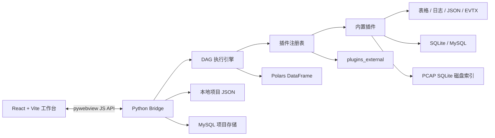
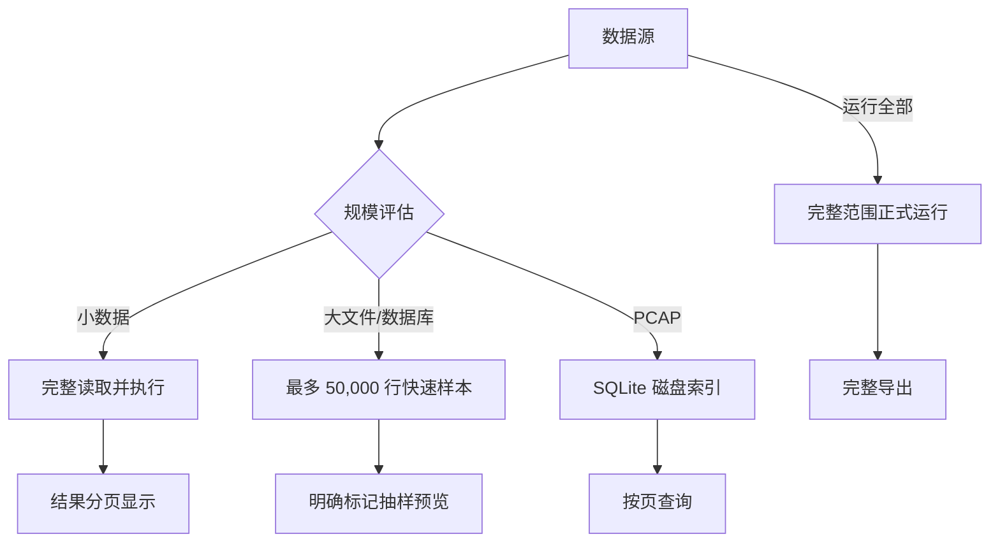

# 数据工坊架构设计

本文描述当前代码库的真实实现，用于帮助维护者理解边界、扩展节点和排查数据完整性问题。它不是未来技术选型草案。

## 设计目标

1. 输入、处理、输出统一为插件节点，核心引擎不依赖具体业务模块。
2. 配置面向普通用户，通过插件元数据自动生成表单。
3. 预览响应速度与正式运行的数据完整性分离。
4. 桌面应用本地优先，并保留 MySQL 项目存储选项。
5. CTF 流量、编码和日志能力可以持续以外部插件扩展。

## 运行时组成

### 前端

- `frontend/src/App.jsx`：工作台状态、项目切换、画布和预览协调。
- `frontend/src/components/ModuleLibrary.jsx`：按插件元数据渲染模块库和分类折叠。
- `frontend/src/components/Inspector.jsx`：把 `ConfigField` 元数据转换为可视化配置控件。
- `frontend/src/components/PreviewTable.jsx`：输入/输出预览、分页、列控制与复制。
- `frontend/src/lib/bridge.js`：桌面桥接与纯浏览器开发适配层。
- `@xyflow/react`：节点、边、缩放和画布交互。

前端不包含 Python 数据处理实现。新增标准插件后，只要其配置字段属于已支持类型，模块库和配置面板会自动出现对应 UI。

### 桌面桥接

`backend/dataworkbench/bridge.py` 是前端可调用 API 的边界，负责：

- 返回插件定义；
- 文件打开/保存对话框；
- 项目创建、读取、保存、重命名和删除；
- MySQL 项目存储测试与初始化；
- 数据源规模评估；
- 样本预览和正式运行调度；
- 线程安全的运行状态与进度查询。

耗时执行不会直接阻塞 UI 调用线程。前端以约 500 ms 周期读取运行状态，并更新进度与画布动画。

### DAG 执行引擎

`backend/dataworkbench/engine.py` 负责：

1. 校验节点和连接；
2. 检测循环；
3. 对目标节点裁剪无关下游/旁路节点；
4. 拓扑排序；
5. 按节点收集一个或多个上游 DataFrame；
6. 调用插件 `validate()` 和 `execute()`；
7. 保存节点结果、行数覆盖值和运行进度。

节点数据使用 `polars.DataFrame` 交换。接入 pandas/SQLAlchemy 的插件应在边界处完成转换，避免让 pandas 类型扩散到执行引擎。

## 插件模型

插件由两部分组成：

- `PluginDefinition`：ID、名称、类型、分类、图标、颜色、说明、配置字段、多输入能力；
- `DataPlugin`：配置校验和执行逻辑。

插件类型：

- `input`：不依赖上游，创建 DataFrame；
- `transform`：读取一个或多个上游 DataFrame，返回新的 DataFrame；
- `output`：预览时透传数据，正式运行时写入外部目标。

ID 必须全局唯一。内置插件在 `plugins/builtin/__init__.py` 聚合；外部插件由 `PluginRegistry.discover()` 扫描 `<目录>/*/plugin.py` 中的 `PLUGINS`。

## 预览与正式运行

这是项目最重要的数据语义。

### 普通数据源

- 小数据预览会完整执行节点，再对最终结果分页；分页不是计算边界。
- 文件约 `>= 32 MiB` 或估算 `>= 250,000` 行时启用大数据策略。
- 大数据样本默认最多 `50,000` 行，并通过 `sampled_sources` 元数据通知前端。
- CSV 正式运行通过 Polars 批次收集；SQLite/MySQL 使用 pandas SQL 分块读取；默认批次为 `50,000` 行。
- 当前版本会把批次重新合并为 DataFrame 后交给后续通用插件，因此降低了读取阶段峰值，但尚不是全链路流式执行。

### PCAP

PCAP/PCAPNG 首次打开时由 `pcap_index.py` 扫描并写入项目缓存中的 SQLite 索引。直接预览 PCAP 节点时只查询当前页。`PCAP 索引完整导出` 必须直接连接 PCAP 输入，并绕过预览 DataFrame，从磁盘索引分批导出所有记录。

### 输出提交

文件输出先写入目标目录中的 `.part` 临时文件；全部成功后使用原子替换提交。异常时清理临时文件，避免半成品被误认为完整结果。数据库输出依赖数据库自身事务/批量写入语义，调用者仍需按目标库制定备份与权限策略。

## 项目存储

### 本地模式

- 桌面版：应用可写目录下的 `projects/*.json`；
- 浏览器开发模式：`localStorage`；
- 项目包含节点、连接、画布位置和配置；数据库密码可能随用户配置进入本地项目文件，因此该目录被 `.gitignore` 排除。

### MySQL 模式

设置页区分两个动作：

- **测试连接**：只验证可达性和认证，不创建对象；
- **初始化存储**：幂等创建数据库、项目表、元数据/版本表和更新时间索引，并保存本地存储配置。

存储模式切换不做隐式数据迁移，以避免未经确认的大范围写入或覆盖。

## 并发与响应性

- 正式运行在后台工作线程中执行；同一 Bridge 实例维护一个活动运行状态。
- UI 只轮询轻量进度对象，不重复传输完整中间结果。
- 实时预览使用防抖，参数连续变化不会对每次键盘输入都执行整条流程。
- 大 PCAP 的分页查询只读取请求页，不把全量 Payload 传输给前端。

## 安全边界

- 桌面应用及外部插件不是沙箱；插件拥有当前用户权限。
- SQLite 自定义查询只接受以 `SELECT` 或 `WITH` 开头的语句；MySQL 高级 SQL 由用户主动配置。
- 数据库标识符经过校验/引用，但目标数据库权限仍由用户账号决定。
- 项目文件、缓存、运行输出、数据库配置和崩溃日志不属于源代码，禁止提交。

## 测试策略

- `backend/tests/test_engine.py`：DAG、通用模块、文件/数据库输入输出、大数据范围和进度。
- `backend/tests/test_ctf.py`：流量会话、协议、编码、爆破和 Flag 扫描。
- `frontend/tests/`：生产构建适配和静态站点入口测试。
- 发布前还需要完成一次真实页面冒烟测试：页面非空、无框架错误层、控制台健康，并验证至少一个节点交互。

## 扩展方向

1. 将 `DataFrame -> DataFrame` 执行协议扩展为批流/磁盘表协议；
2. 为插件声明版本、资源预算、权限与兼容范围；
3. 引入项目格式版本迁移器；
4. 对输出提供更统一的两阶段提交和取消语义；
5. 增加可重放的端到端桌面测试和 Release 构建校验。
